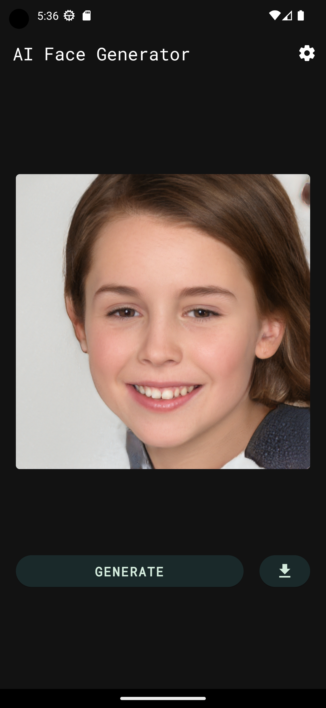
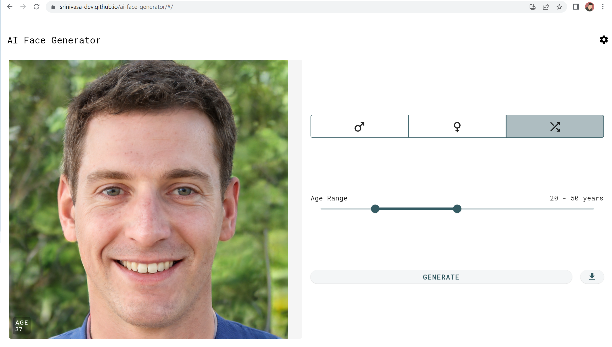
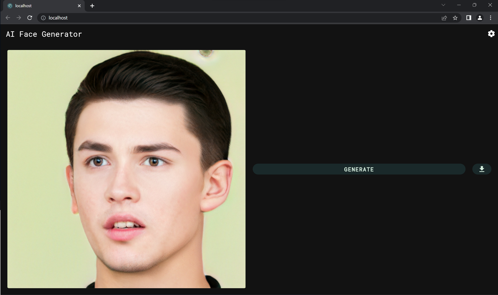
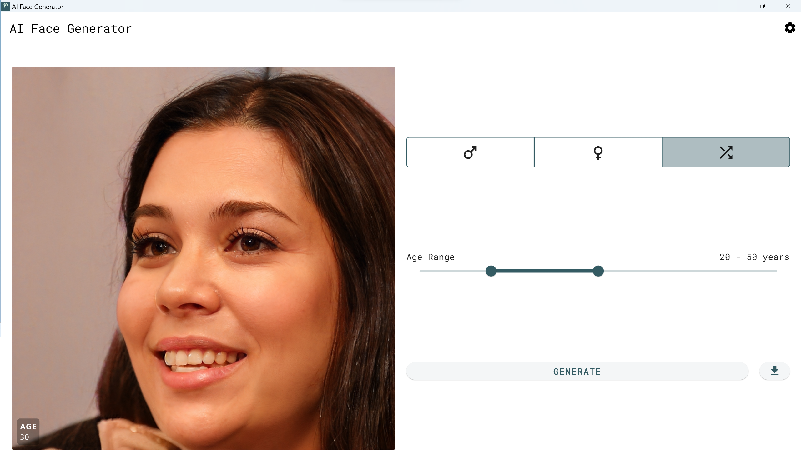
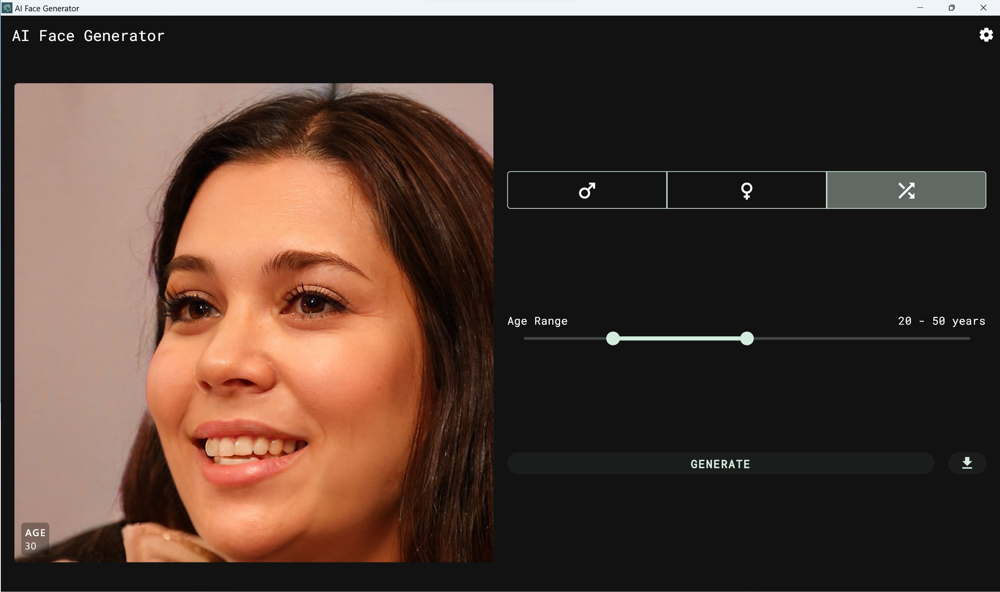

# AI Face Generator

An AI flutter App to generate random faces. The Generated faces do not actually exist in real life. This app uses the [100k-faces](https://github.com/ozgrozer/100k-faces) API.

> As the CORS is not enabled for the server used by the API, to run this project on web please use `flutter run -d chrome --web-browser-flag "--disable-web-security"` command.

### 📥 Check out the app

| OS | Actions                                                                                                                                                            |
|----------|--------------------------------------------------------------------------------------------------------------------------------------------------------------------|
| Android   |  |
| Web   |                                                     |
| Windows |   |

### 📸 Screenshots

| Platform  | Light | Dark |
|----------|----------|----------|
| Mobile |    |    |
| Web |    |    |
| Windows |    |    |